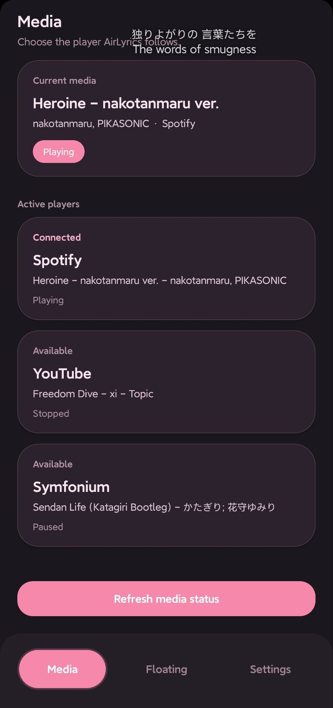
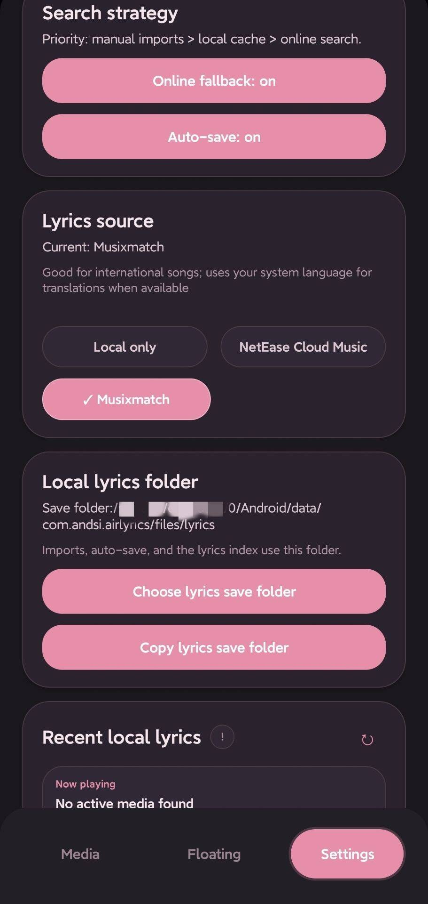
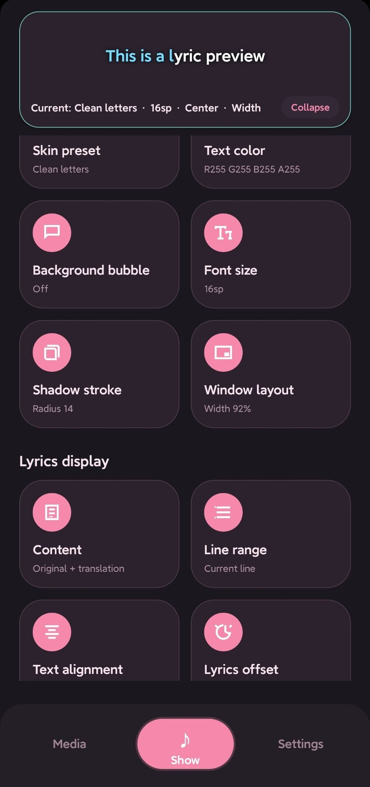

<!--suppress HtmlDeprecatedAttribute -->
<div align="center">

<!--suppress CheckImageSize -->


# AirLyrics

A lightweight Android floating lyrics app that detects current media playback and shows synced
lyrics in a customizable floating window.

[English](README.md) · [简体中文](README.zh-CN.md)

<br />

[Download](https://github.com/AirLyrics/AirLyrics/releases) · [Documentation](docs/README.md) ·
[Privacy](PRIVACY.md) · [Report Bug](https://github.com/AirLyrics/AirLyrics/issues)

<br />

[]()
[]()
[]()
[](https://github.com/AirLyrics/AirLyrics/releases)

</div>

---

<!--suppress HtmlDeprecatedAttribute -->
<div align="center">

<!--suppress CheckImageSize -->


</div>

---

## Status

AirLyrics is stable and actively maintained.

The current release is intended for daily use. Future updates will mainly focus on bug fixes,
compatibility improvements, documentation updates, and reviewing issues or pull requests.

Compatibility may still vary depending on Android version, device manufacturer and music app.

---

## Download

Download the latest APK from [GitHub Releases](https://github.com/AirLyrics/AirLyrics/releases).

System requirement: Android 8.0 or later.

---

## Features

- Automatically detects current media playback
- Displays synced lyrics above other apps
- Provides online lyrics search
- Supports local lyrics import, including same-timestamp translation lines
- Supports word-by-word lyrics import with translation-aware normal lyric generation
- Customizable floating window style
- Adjustable lyrics offset
- Supports original / translated lyrics display
- Supports light / dark themes

---

## Quick Start

1. Install AirLyrics.
2. Grant permissions.
3. Select the current media source.
4. Show the floating lyrics window.

---

## Screenshots

<!--suppress HtmlDeprecatedAttribute -->
<div align="center">

<table>
  <tr>
    <!--suppress HtmlDeprecatedAttribute -->
    <td align="center">
      <!--suppress CheckImageSize -->
      
      <br />
      <sub>Media Source</sub>
    </td>
    <!--suppress HtmlDeprecatedAttribute -->
    <td align="center">
      <!--suppress CheckImageSize -->
      
      <br />
      <sub>Lyrics Search</sub>
    </td>
    <!--suppress HtmlDeprecatedAttribute -->
    <td align="center">
      <!--suppress CheckImageSize -->
      
      <br />
      <sub>Floating Customization</sub>
    </td>
  </tr>
</table>

</div>

---

## Permissions

AirLyrics uses these Android permissions:

| Permission              | Purpose                         |
|-------------------------|---------------------------------|
| Display over other apps | Show the floating lyrics window |
| Notification access     | Detect current media playback   |
| File picker             | Import local lyrics files       |

See [Privacy Policy](PRIVACY.md) for details about permissions, local data and online lyrics search.

---

## Documentation

Project documentation is in the docs directory.

| Document                               | Description                                                    |
|----------------------------------------|----------------------------------------------------------------|
| [Documentation Home](docs/README.md)   | English documentation index                                    |
| [Privacy Policy](PRIVACY.md)           | Permissions, local data and online lyrics search privacy notes |
| [User Guide](docs/USER_GUIDE.md)       | Project usage guide                                            |
| [Lyrics Format](docs/LYRICS_FORMAT.md) | Local import, normal LRC and word-by-word lyrics format        |
| [Contributing](docs/CONTRIBUTING.md)   | Development environment, PR workflow and code locations        |
| [Architecture](docs/ARCHITECTURE.md)   | Module layout and runtime flow                                 |

---

## Build From Source

### Requirements

- JDK 17
- Android SDK
- Android NDK `26.3.11579264` required
- Rust stable via `rustup`
- `cargo-ndk`
- Rust Android target:
  - `aarch64-linux-android` is required for the default `arm64-v8a` build
- Optional Rust Android target:
  - `x86_64-linux-android` is only needed when building with `-Pairlyrics.buildX86_64=true`

Android Studio is recommended when configuring Android SDK related settings.

### Clone

```bash
git clone https://github.com/AirLyrics/AirLyrics.git
cd AirLyrics
```

### Build

```bash
./gradlew assembleDebug
```

The APK will be generated under:

```txt
app/build/outputs/apk/debug/
```

---

## Contributing

Contributions are welcome. AirLyrics is stable and actively maintained, so small and focused
changes are preferred.

Good areas to contribute:

- Bug reports
- Compatibility testing
- Translation improvements
- Documentation improvements
- UI text polishing

Contribution guide: [CONTRIBUTING.md](docs/CONTRIBUTING.md).

---

## Credits

- [waylyrics](https://github.com/waylyrics/waylyrics)

---

## License

AirLyrics is licensed under the MIT License.

See [LICENSE](LICENSE).
