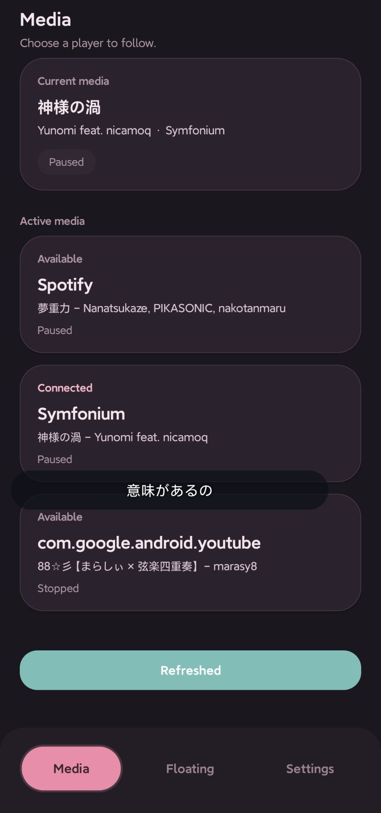
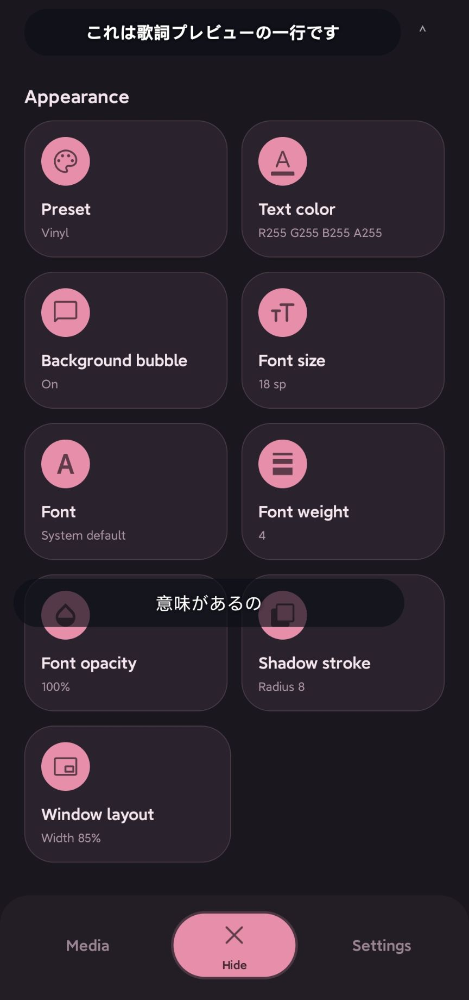
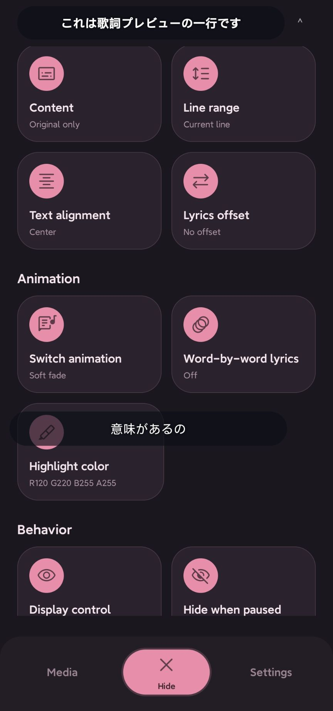
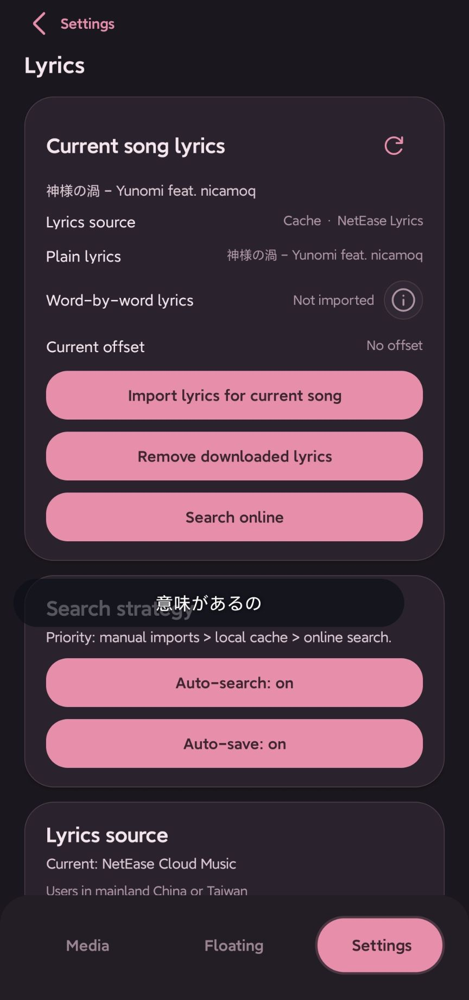
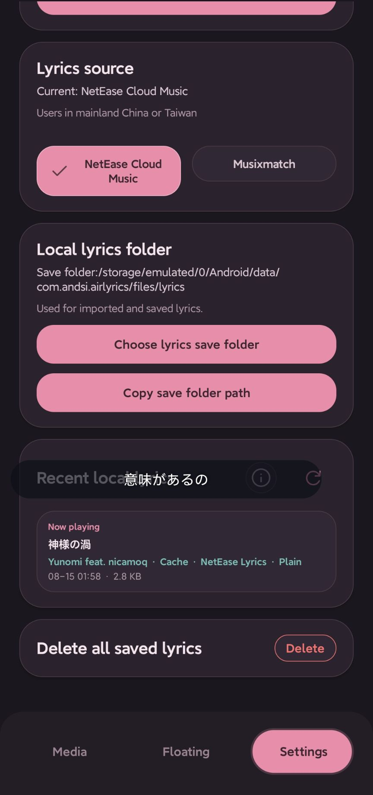
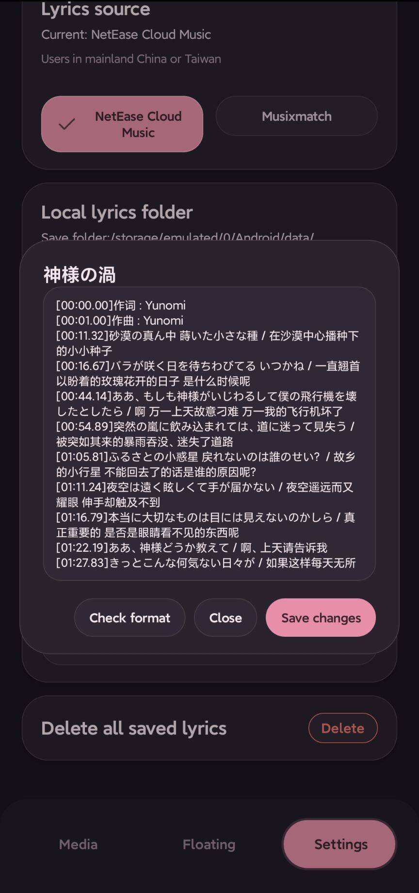
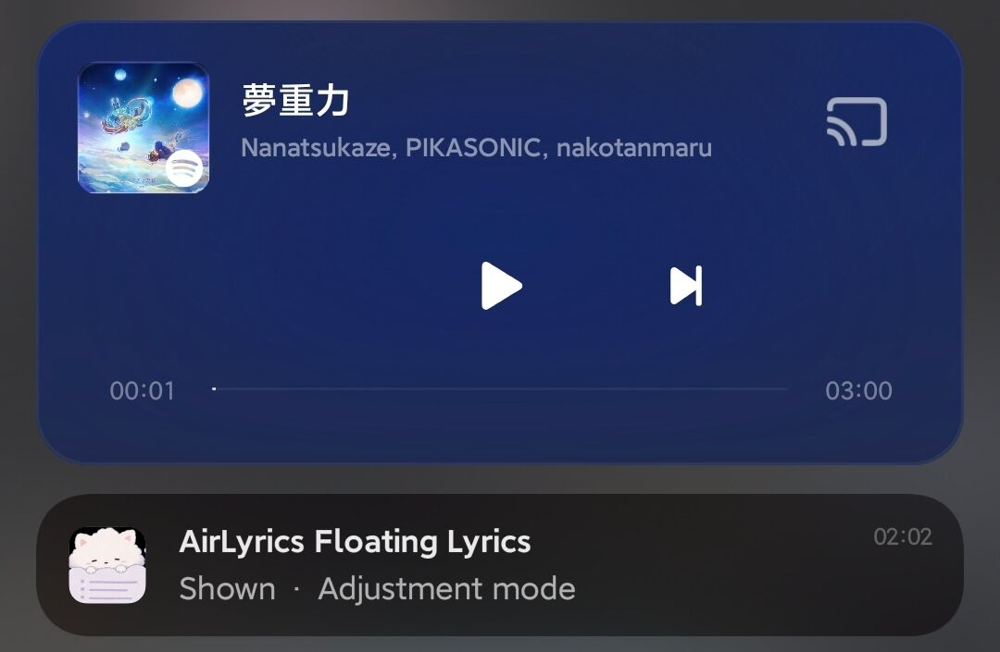

<!--suppress HtmlDeprecatedAttribute -->
<div align="center">

<!--suppress CheckImageSize -->


# AirLyrics

A lightweight floating lyrics app for Android. Displays synced lyrics for the song currently
playing, with a customizable overlay and support for importing local lyrics.

[English](README.md) · [简体中文](README.zh-CN.md)

<br />

[Download](https://github.com/AirLyrics/AirLyrics/releases) · [Docs](docs/README.md) ·
[Privacy Policy](PRIVACY.md) · [Feedback](https://github.com/AirLyrics/AirLyrics/issues)

<br />


[](https://github.com/AirLyrics/AirLyrics/releases)

</div>

---

<!--suppress HtmlDeprecatedAttribute -->
<div align="center">

<!--suppress CheckImageSize -->


</div>

---

## Project Status

AirLyrics is ready for everyday use and is actively maintained.

Compatibility may vary depending on the Android version, device manufacturer, and music app.
If something isn't working or there's a feature you'd like to see, feel free to open an
[issue](https://github.com/AirLyrics/AirLyrics/issues).

---

## Quick Start

1. Install AirLyrics (Android 8.0 or later required).
2. Grant the required permissions.
3. Play some music, then manually select the corresponding media source in AirLyrics.
4. Open the **Overlay** page and tap **Show** in the bottom bar.

For more settings and help with common problems, see the [User Guide](docs/USER_GUIDE.md).

---

## Features

- **Lyrics search and import**: Follows song changes in the selected player and searches for lyrics
  through NetEase Cloud Music or Musixmatch. You can also import local LRC and TTML files, with
  support for common timing and translation fields used by Apple Music and AMLL, original lyrics,
  translations, and word-by-word highlighting.
- **Overlay appearance**: Adjust the font, weight, colors, opacity, window style, and transition
  animations, with a live preview as you make changes. You can also import your own fonts.
- **Themes**: Choose a light or dark theme, or follow the system setting, with several accent colors
  available.
- **Display controls**: Automatically hide lyrics when playback is paused, lock the window, let taps
  pass through it, or control it from the notification. You can also limit the overlay to selected
  apps.
- **Lyrics management**: Save timing offsets for individual songs, and browse, search, edit, or
  delete local lyrics.

---

## Screenshots

<!--suppress HtmlDeprecatedAttribute -->
<div align="center">

<table>
  <tr>
    <!--suppress HtmlDeprecatedAttribute -->
    <td align="center">
      <!--suppress CheckImageSize -->
      
      <br />
      <sub>Media</sub>
    </td>
    <!--suppress HtmlDeprecatedAttribute -->
    <td align="center">
      <!--suppress CheckImageSize -->
      
      <br />
      <sub>Overlay appearance</sub>
    </td>
    <!--suppress HtmlDeprecatedAttribute -->
    <td align="center">
      <!--suppress CheckImageSize -->
      
      <br />
      <sub>Overlay controls</sub>
    </td>
  </tr>
  <tr>
    <!--suppress HtmlDeprecatedAttribute -->
    <td align="center">
      <!--suppress CheckImageSize -->
      
      <br />
      <sub>Current lyrics</sub>
    </td>
    <!--suppress HtmlDeprecatedAttribute -->
    <td align="center">
      <!--suppress CheckImageSize -->
      
      <br />
      <sub>Local lyrics</sub>
    </td>
    <!--suppress HtmlDeprecatedAttribute -->
    <td align="center">
      <!--suppress CheckImageSize -->
      
      <br />
      <sub>Lyrics editor</sub>
    </td>
  </tr>
  <tr>
    <!--suppress HtmlDeprecatedAttribute -->
    <td align="center" colspan="3">
      <!--suppress CheckImageSize -->
      
      <br />
      <sub>System settings</sub>
    </td>
  </tr>
</table>

<!--suppress CheckImageSize -->

<br />
<sub>Notification controls</sub>

</div>

---

## Permissions

AirLyrics uses the following permissions and system features:

| Permission / System Feature | Purpose |
| --- | --- |
| Display over other apps | Show the floating lyrics window |
| Notification access | Read information about the media currently playing |
| Notifications | Show the foreground service notification and control buttons |
| Usage access | Check whether selected apps are visible to control when the lyrics overlay appears (optional, Android 10+) |
| Network access | Search for lyrics online |
| File picker | Import local lyrics and choose a folder for saving lyrics |

For details about permissions, data storage, and online searches, see the
[Privacy Policy](PRIVACY.md).

---

## Documentation

| Document | Contents |
| --- | --- |
| [Documentation Home](docs/README.md) | English documentation index |
| [Privacy Policy](PRIVACY.md) | Permissions, data storage, and online searches |
| [User Guide](docs/USER_GUIDE.md) | Usage instructions and common problems |
| [Lyrics Formats](docs/LYRICS_FORMAT.md) | Importing local LRC and TTML files |
| [Contributing Guide](docs/CONTRIBUTING.md) | Development setup, contribution workflow, and code locations |
| [Project Architecture](docs/ARCHITECTURE.md) | Modules and how the app runs |

---

## Building from Source

### Requirements

- JDK 17
- Android SDK
- Android NDK `26.3.11579264`
- Rust stable (installed through `rustup`)
- `cargo-ndk`
- Rust Android targets:
  - The default `arm64-v8a` build requires `aarch64-linux-android`.
  - Building with `-Pairlyrics.buildX86_64=true` also requires `x86_64-linux-android`.

Android Studio is recommended for installing and configuring the Android SDK and NDK.
For detailed setup instructions, see the [Contributing Guide](docs/CONTRIBUTING.md).

### Clone the Repository

```bash
git clone https://github.com/AirLyrics/AirLyrics.git
cd AirLyrics
```

### Build a Debug APK

```bash
./gradlew assembleDebug
```

Once the build finishes, the APK will be in:

```txt
app/build/outputs/apk/debug/
```

---

## Feedback and Contributions

Bug reports and suggestions are welcome on
[GitHub Issues](https://github.com/AirLyrics/AirLyrics/issues).
When reporting a bug, please include your device model, Android version, music app, and steps to
reproduce the problem if possible.
Screenshots or a short video are helpful too.

If you'd like to contribute code, the [Contributing Guide](docs/CONTRIBUTING.md) is a good place to
start.

Thanks so much to everyone who has shared feedback or contributed.

---

## Acknowledgments

- [waylyrics](https://github.com/waylyrics/waylyrics)

---

## License

This project is licensed under the [MIT License](LICENSE).
