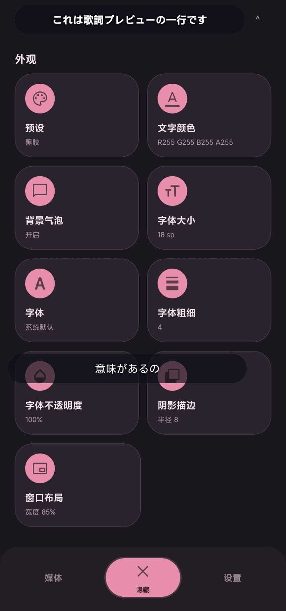
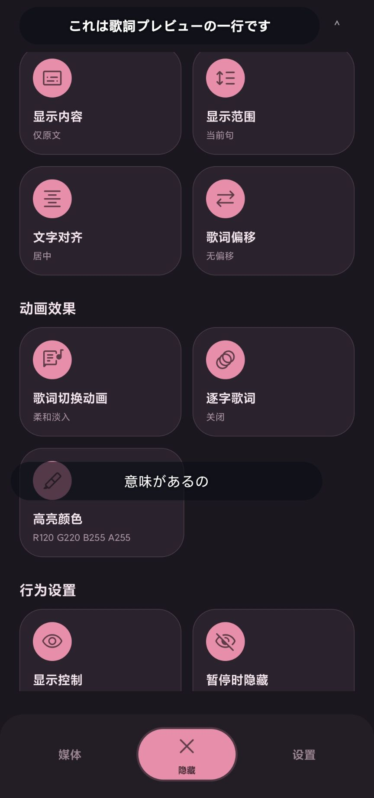
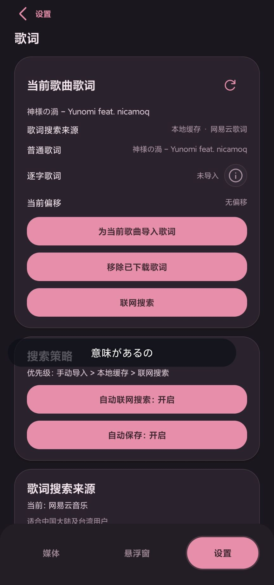
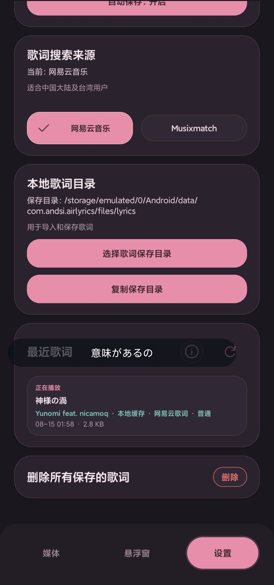
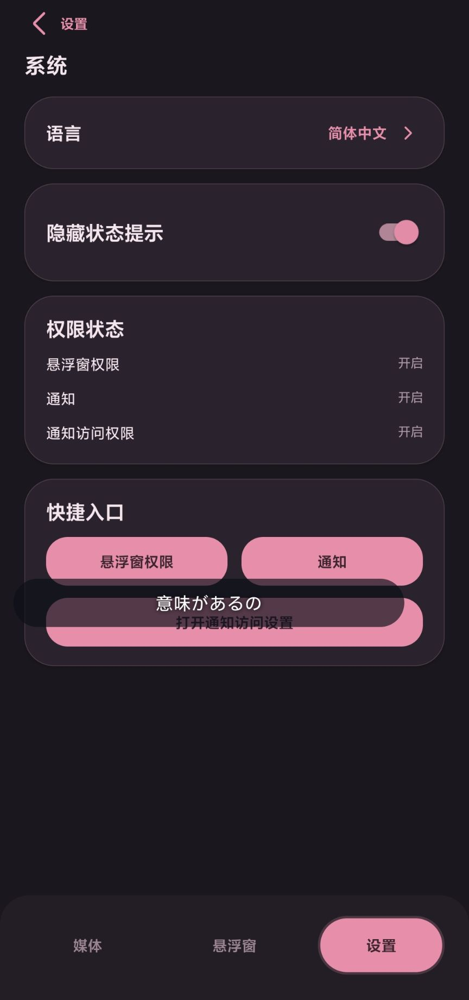
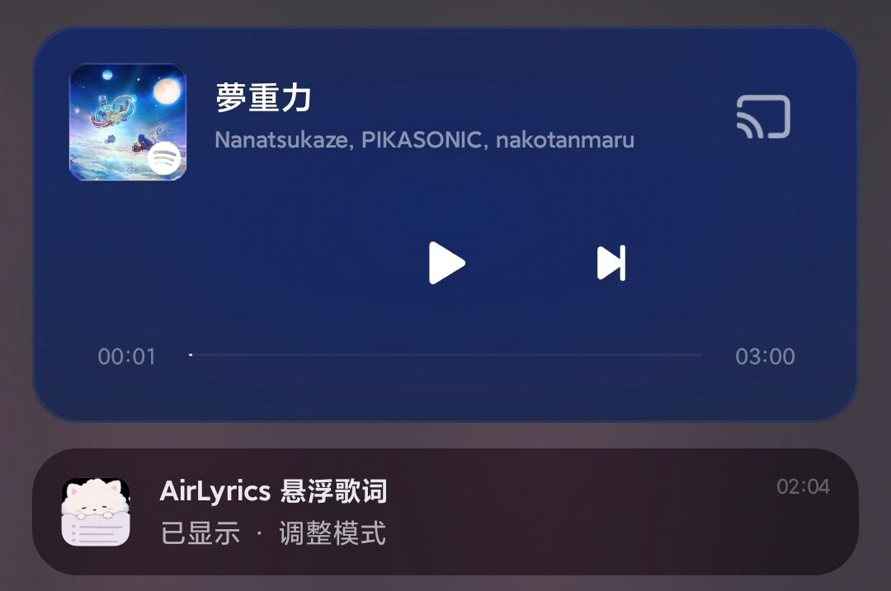

<!--suppress HtmlDeprecatedAttribute -->
<div align="center">

<!--suppress CheckImageSize -->


# AirLyrics

一个轻量的 Android 悬浮歌词应用。跟随当前播放的歌曲显示同步歌词，支持调整悬浮窗外观和导入本地歌词。

[English](README.md) · [简体中文](README.zh-CN.md)

<br />

[下载](https://github.com/AirLyrics/AirLyrics/releases) · [文档](docs/README.zh-CN.md) ·
[隐私政策](PRIVACY.zh-CN.md) · [建议与反馈](https://github.com/AirLyrics/AirLyrics/issues)

<br />


[](https://github.com/AirLyrics/AirLyrics/releases)

</div>

---

<!--suppress HtmlDeprecatedAttribute -->
<div align="center">

<!--suppress CheckImageSize -->


</div>

---

## 项目状态

AirLyrics 目前已可用于日常听歌，仍在持续维护和改进。

不同 Android 版本、设备厂商和音乐应用可能存在兼容性差异。
如果遇到问题，或有想要的功能，非常欢迎提交 [Issue](https://github.com/AirLyrics/AirLyrics/issues)。

---

## 快速开始

1. 安装 AirLyrics（需要 Android 8.0 或更高版本）。
2. 授予必要权限。
3. 播放音乐，并在 AirLyrics 中手动选择对应的媒体源。
4. 打开 **悬浮窗** 页面，点击底栏的 **显示**。

更多设置和常见问题见[使用说明书](docs/USER_GUIDE.zh-CN.md)。

---

## 功能一览

- **歌词搜索与导入**：跟随所选播放器切换歌曲，通过网易云音乐或 Musixmatch 搜索歌词；
  也可导入本地 LRC 和 TTML，兼容 Apple Music 与 AMLL 常见的时间和翻译字段，
  支持原文、翻译和逐字高亮。
- **悬浮窗外观**：调整字体、字重、颜色、透明度、窗口样式和切换动画，
  修改时可实时预览，也支持导入字体。
- **主题**：支持浅色、深色和跟随系统，可选择不同的强调色。
- **显示控制**：支持暂停时自动隐藏、锁定窗口、点击穿透和通知栏控制，
  也可设置为仅在所选应用中显示。
- **歌词管理**：按歌曲保存时间偏移，浏览、搜索、编辑和删除本地歌词。

---

## 截图

<!--suppress HtmlDeprecatedAttribute -->
<div align="center">

<table>
  <tr>
    <!--suppress HtmlDeprecatedAttribute -->
    <td align="center">
      <!--suppress CheckImageSize -->
      
      <br />
      <sub>媒体</sub>
    </td>
    <!--suppress HtmlDeprecatedAttribute -->
    <td align="center">
      <!--suppress CheckImageSize -->
      
      <br />
      <sub>悬浮歌词外观</sub>
    </td>
    <!--suppress HtmlDeprecatedAttribute -->
    <td align="center">
      <!--suppress CheckImageSize -->
      
      <br />
      <sub>悬浮窗控制</sub>
    </td>
  </tr>
  <tr>
    <!--suppress HtmlDeprecatedAttribute -->
    <td align="center">
      <!--suppress CheckImageSize -->
      
      <br />
      <sub>当前歌词</sub>
    </td>
    <!--suppress HtmlDeprecatedAttribute -->
    <td align="center">
      <!--suppress CheckImageSize -->
      
      <br />
      <sub>本地歌词管理</sub>
    </td>
    <!--suppress HtmlDeprecatedAttribute -->
    <td align="center">
      <!--suppress CheckImageSize -->
      
      <br />
      <sub>歌词编辑</sub>
    </td>
  </tr>
  <tr>
    <!--suppress HtmlDeprecatedAttribute -->
    <td align="center" colspan="3">
      <!--suppress CheckImageSize -->
      
      <br />
      <sub>系统设置</sub>
    </td>
  </tr>
</table>

<!--suppress CheckImageSize -->

<br />
<sub>通知栏控制</sub>

</div>

---

## 权限说明

AirLyrics 使用以下权限或系统功能：

| 权限 / 系统功能 | 用途 |
| --- | --- |
| 显示在其他应用上层 | 显示悬浮歌词窗口 |
| 通知访问权限 | 获取当前播放的媒体信息 |
| 通知权限 | 显示前台服务通知及控制按钮 |
| 使用情况访问 | 判断所选应用是否可见，用于控制悬浮歌词的显示（可选，Android 10+） |
| 网络访问 | 在线搜索歌词 |
| 文件选择器 | 导入本地歌词、选择歌词保存目录 |

有关权限、数据存储和联网搜索的详细说明，见[隐私政策](PRIVACY.zh-CN.md)。

---

## 文档

| 文档 | 内容 |
| --- | --- |
| [文档首页](docs/README.zh-CN.md) | 中文文档索引 |
| [隐私政策](PRIVACY.zh-CN.md) | 权限、数据存储与联网搜索 |
| [使用说明书](docs/USER_GUIDE.zh-CN.md) | 使用方法与常见问题 |
| [歌词格式](docs/LYRICS_FORMAT.zh-CN.md) | 本地 LRC 与 TTML 导入说明 |
| [贡献指南](docs/CONTRIBUTING.zh-CN.md) | 开发环境、提交流程与代码位置 |
| [项目架构](docs/ARCHITECTURE.zh-CN.md) | 模块划分与运行流程 |

---

## 从源码构建

### 环境要求

- JDK 17
- Android SDK
- Android NDK `26.3.11579264`
- Rust stable（通过 `rustup` 安装）
- `cargo-ndk`
- Rust Android 编译目标：
  - 默认构建 `arm64-v8a`，需要安装 `aarch64-linux-android`。
  - 使用 `-Pairlyrics.buildX86_64=true` 构建时，还需安装 `x86_64-linux-android`。

推荐通过 Android Studio 安装和配置 Android SDK、NDK。
开发环境的详细配置见[贡献指南](docs/CONTRIBUTING.zh-CN.md)。

### 克隆仓库

```bash
git clone https://github.com/AirLyrics/AirLyrics.git
cd AirLyrics
```

### 构建 Debug APK

```bash
./gradlew assembleDebug
```

构建完成后，APK 位于：

```txt
app/build/outputs/apk/debug/
```

---

## 反馈与贡献

欢迎通过 [GitHub Issues](https://github.com/AirLyrics/AirLyrics/issues) 反馈问题或提出建议。
反馈 Bug 时，请尽量附上设备型号、Android 版本、使用的音乐应用和复现步骤，方便排查。
有图片或者视频也很好。

想参与开发，可以先阅读[贡献指南](docs/CONTRIBUTING.zh-CN.md)。

真的感谢所有提供反馈和参与贡献的人。

---

## 鸣谢

- [waylyrics](https://github.com/waylyrics/waylyrics)

---

## 许可证

本项目采用 [MIT License](LICENSE)。
